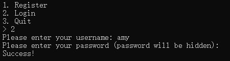
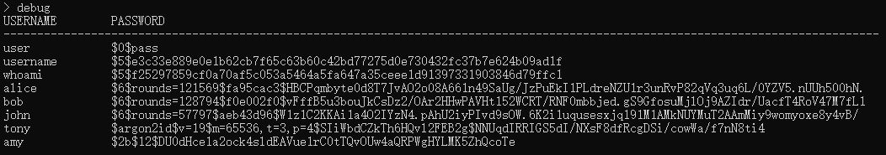

# Introduction
Try this demo for testing password storage! This repo is for Cryptographic Final Project. It currently supports password hashing methods including SHA256, SHA512, Bcrypt and Argon2id! 

## Requirements and Installation
Python version `python >= 3.6`

Install packages using `pip install -r requirements.txt`

Run the program using `python app.py`

## More detailed usage

There's current two functionalities supported. By entering `1`, which enters the register functionality, you can input your username and password following the prompt.

As shown in the prompt, there are 5 choices for storing password
* Plaintext. As its name indicates, passwords are stored in plaintext without any hashing and protection
* Pure SHA-256. The password is stored by just applying sha256(password). This is still weak unless you use a very complex password.
* SHA-512. The password is stored using SHA-512 with salt, pepper and rounds. The salt is a random 4-byte hex string for each password, the pepper is uniquely stored inside the server code which is a 4-byte fixed string. It also applies at randomly 50000-150000 rounds of sha512 to the password.
* Bcrypt. The password is hashed using bcrypt
* Argon2id. The password is hashed using argon2id, the winner of password hashing competition!

After registering, you are directed to the menu and by selecting 2, you can verify your credential. If the password matches, you will see a Success! info.

## View in Database
As a hacker, you secretly discovered that there is a hidden option `debug` that allows you to view the whole database! What can you obtain from here?

In the database, different encryption methods are marked with different prefix `${id}$`. Here's a brief introduction to those formats:

* `$0$`. This means the password is just stored in plaintext. You can directly obtain the password for user choosing this storing method!
* `$5$`. This means the password is stored after hashing with SHA-256. This is still dangerous since only limited effort is needed to crack your password unless you follows a nice password policy!
* `$6$`. This means the password is stored after hashing with SHA-512, the salt, rounds is also included in the format `$6$round={round}${salt}$hashedpassword`. 
* `$2b$`. This is the format for [Bcrypt](https://github.com/pyca/bcrypt/). It only takes one work factor indicates the resource or time it needed, the program uses the default `$12$` rounds here.
* `$argon2id$`. This is the format for [argon2id](https://github.com/hynek/argon2-cffi). The winner!. It has 5 parameter here, version(v=19), memory (m), iterations (t), degree of parallesim (p) and a random generated salt. The memory, iterations and degree of parallesim is fixed with 64MB, 3 iterations, 4 degrees of parallesim which is already pretty strong!