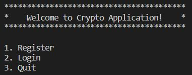
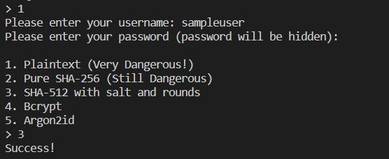

# Introduction
Try this demo for testing password storage! This repo is for Cryptographic Final Project. It currently supports password hashing methods including SHA256, SHA512, Bcrypt and Argon2id! 

## Requirements and Installation
Python version `python >= 3.6`

Install packages using `pip install -r requirements.txt`

Run the program using `python app.py`

## More detailed usage

There's current two functionalities supported. By entering `1`, which enters the register functionality, you can input your username and password following the prompt.

As shown in the prompt, there are 5 choices for storing password
* Plaintext. As its name indicates, passwords are stored in plaintext without any hashing and protection
* Pure SHA-256. The password is stored by just applying sha256(password). This is still weak unless you use a very complex password.
* SHA-512. The password is stored using SHA-512 with salt, pepper and rounds. The salt is a random 4-byte hex string for each password, the pepper is uniquely stored inside the server code which is a 4-byte fixed string. It also applies at randomly 50000-150000 rounds of sha512 to the password.
* Bcrypt. The password is hashed using bcrypt
* Argon2id. The password is hashed using argon2id, the winner of password hashing competition!
